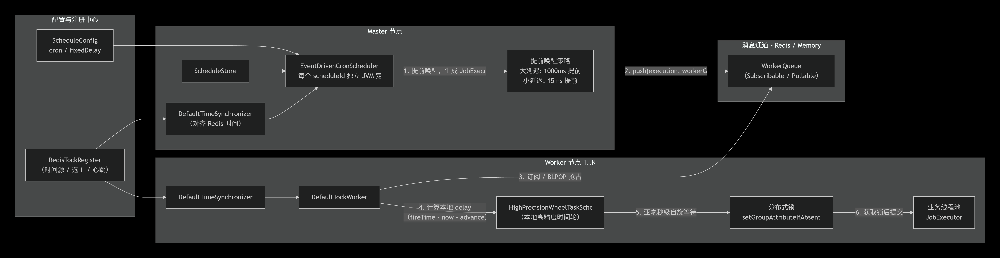
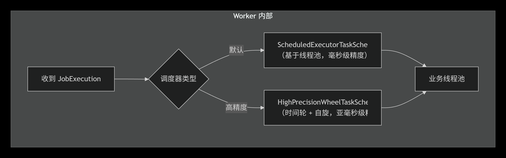

# 架构与设计

本文描述的是当前 `tock-core` 的实际运行路径，而不是早期设计草稿。

## 总体结构

```text
          +-------------------+
          |   ScheduleStore   |
          +---------+---------+
                    |
                    v
          +-------------------+
          | Master Scheduler  |
          | EventDrivenCron   |
          +---------+---------+
                    |
           JobExecution push
                    |
                    v
          +-------------------+
          |   WorkerQueue     |
          +---------+---------+
                    |
                    v
          +-------------------+
          |  DefaultTockWorker|
          +---------+---------+
                    |
                    v
          +-------------------+
          |   JobExecutor     |
          +-------------------+
```

## 生命周期

`Tock.configure(config)` 只负责装配；真正启动发生在 `Tock.start()`：

1. 启动 `TimeSynchronizer`
2. 启动 `workerExecutor`
3. 给 `TockMaster` 注册监听器
4. 给当前节点注册 `NodeListener`
5. 启动 `jobRegistry` / `jobStore` / `workerQueue`
6. 启动 `register`
7. 当前节点进入 running 后，Worker 开始消费
8. 选主成功后，Scheduler 启动；失去主身份则停止调度

## Master-Worker 模型

## Master

只有 Master 节点负责调度：

- 读取 `ScheduleStore`
- 计算下一次 `fireTime`
- 提前唤醒，把 `JobExecution` 推到 `WorkerQueue`

Redis 模式下，`RedisTockMaster` 使用：

- `SET key value NX PX leaseTimeoutMs` 抢主
- Lua 脚本续租
- 定时心跳失败后立即释放主身份

## Worker

所有节点都可以是 Worker：

- 通过 `joinGroup(group)` 声明自己消费哪些 `workerGroup`
- 从 `WorkerQueue` 收到 `JobExecution`
- 基于统一同步时间算剩余延迟
- 到点前再次复核同步时间，避免等待期间 offset 变化导致提前执行
- 进入 `doExecuteJob()` 前抢占 group attribute 锁，保证同一计划同一时刻只被一个 Worker 真正执行

## 时间模型

时间链路是这次修复的关键：

1. `timeProvider` 提供原始时间源
2. `DefaultTimeSynchronizer` 基于最小 RTT 样本估算 offset
3. `TockContext.currentTimeMillis()` 作为调度器和 Worker 的统一时间基准
4. `JobContext.actualFireTime` 也使用同步时间，而不是直接使用墙钟

Redis 模式下：

- `RedisTockRegister` 通过 Redis `TIME` 提供远端时间
- `DefaultTimeSynchronizer` 周期性对齐本地单调时间轴

## 调度器：`EventDrivenCronScheduler`

当前调度器不是“轮询所有计划”，而是**事件驱动**：

- 每个 `scheduleId` 对应一个 JVM `ScheduledFuture`
- 配置变更依赖 `ScheduleStore.getGlobalVersion()`
- `cron` 与 `fixedDelayMs` 二选一
- 调度器会提前唤醒：
  - 延迟大于等于 1000ms：提前 1000ms
  - 延迟小于 1000ms：提前 15ms

### 最近修复的关键点

提前唤醒后，调度器不能再用“当前时间 now”去推导下一次 cron。  
当前实现将：

- **下一次 fireTime 的推导基准**：设为当前 `fireTime - 1ms`
- **本次等待 delay 的计算基准**：继续使用当前同步时间

这样避免了 Redis 模式下的重复命中当前时间窗、1ms 级连锁重排和同秒连发。

## Worker 执行器

当前有两类本地执行器：

| 执行器 | 类 | 说明 |
| --- | --- | --- |
| 默认执行器 | `ScheduledExecutorTaskScheduler` | 简单，依赖 JDK 调度器 |
| 高精度执行器 | `HighPrecisionWheelTaskScheduler` | 单层时间轮，1ms tick，分段 park + 最终自旋 |



`DefaultTockWorker` 在收到计划后会：

1. 记录 pending 标记（若开启 `pendingExecutionRecoveryEnabled`）
2. 计算 `nextFireTime - context.currentTimeMillis()`
3. 交给本地执行器等待
4. 本地定时器触发时再次确认同步时间是否已到点
5. 真正执行前写入 `consumer.<group>.<schedule>` 锁

## 存储与队列

## `ScheduleStore`

- Memory：`ConcurrentHashMap + version`
- Redis：`Hash(schedules) + String(schedules:version)`

调度器只在版本变化时重新装载配置。

## `WorkerQueue`

- Memory：测试用内存队列，支持 pull / subscribe 两种实现
- Redis：`List(queue:<workerGroup>:pending)`，消费端使用 `BLPOP`

Redis 队列不是精度瓶颈；最近一次本机诊断里，平均队列延迟维持在 `~1ms`。

## `JobStore`

`JobStore` 仍保留在公共 API 中，但**当前默认事件驱动调度热路径不依赖它**。  
如果你只使用 `EventDrivenCronScheduler + WorkerQueue`，可以不额外配置持久化 `JobStore`。

## 故障恢复

### Master 故障转移

- Master 租约由 Redis key 承载
- Standby 节点按 `heartbeatIntervalMs` 重试选主
- 失去主身份时当前调度器立即停机

### 节点过期清理

`EventDrivenCronScheduler` 每秒扫描过期节点：

- 读取 `register.getExpiredNodes()`
- 回收残留的 active / pending 执行标记
- 必要时重推未真正完成的计划

### Worker 主动退出

`DefaultTockWorker.stop()` / `leaveGroup()` 会：

- 取消本地 Future
- 清理 pending 标记
- 对仍然有效的计划重新入队

## 当前已验证的事实

基于现有集成测试：

- Redis `TIME` 精度本地可稳定维持在亚毫秒到低毫秒量级
- Redis 队列本身在同机环境下平均延迟约 `0.8ms`
- 修复后 Redis 模式已消除“时间越跑越早、同秒重复连发”的核心故障模式

详细数据见 [../PERFORMANCE.md](../PERFORMANCE.md) 与 [time-sync-ab-report.md](time-sync-ab-report.md)。
